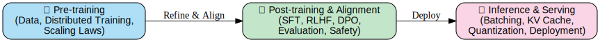

# LLM Infra Guidebook

A curated list of resources, tools, and projects for building and scaling large language model infrastructure.

## Contents

- [Pre-training](pretraining.md)
- [Post-training & Alignment](posttraining.md)
- [Inference & Serving](inference.md)
- [Optimization](optimization.md)
- [Monitoring & Reliability](monitoring.md)
- [Learning Roadmap](roadmap.md)