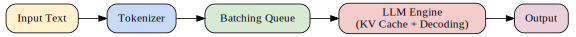

# ⚡ Inference & Serving

## 🔎 Overview  
Inference is where a trained LLM delivers value to end-users. Unlike pre-training or fine-tuning, which are offline processes, inference must run **in real time** with strict constraints on **latency, throughput, cost, and reliability**.  

Key challenges:  
- **Latency** — Users expect sub-second responses, even with billion-parameter models.  
- **Throughput** — Serving thousands of concurrent requests on limited hardware.  
- **Memory** — Long context windows can blow up GPU memory usage.  
- **Scalability** — Efficiently distributing inference across GPUs/nodes.  

---

## 🏗 The Serving Stack  

Typical serving flow for an LLM request:  

1. **Tokenization** → Convert input text into token IDs.  
2. **Batching & Queuing** → Aggregate multiple requests for GPU efficiency.  
3. **KV-Cache Reuse** → Store intermediate attention states, avoiding recomputation.  
4. **Decoding** → Greedy, sampling, beam search.  
5. **Post-processing** → Detokenization, formatting, optional RAG integration.  

---

## 📦 Key Frameworks  

- **[vLLM](https://github.com/vllm-project/vllm)**  
  Introduces *PagedAttention* for efficient memory paging, achieving high throughput with long contexts. Powers services like Llama.cpp inference in production.  

- **[TensorRT-LLM](https://github.com/NVIDIA/TensorRT-LLM)**  
  NVIDIA’s inference stack with optimized GPU kernels, quantization, and integration with Triton.  

- **[Triton Inference Server](https://github.com/triton-inference-server/server)**  
  Production-scale serving framework with autoscaling, multi-model serving, and monitoring hooks.  

- **[Petals](https://github.com/bigscience-workshop/petals)**  
  Decentralized inference — community hosts shards of a large model and users collaborate to run it.  

---

## ⚖️ Trade-offs in Serving  

| **Dimension**       | **Option A** | **Option B** | **Trade-off** |
|----------------------|--------------|--------------|----------------|
| **Batch size**       | Small (low latency) | Large (high throughput) | User experience vs hardware efficiency |
| **Precision**        | FP16 | INT8/INT4 (quantized) | Model quality vs cost |
| **Serving style**    | Centralized (vLLM/Triton) | Decentralized (Petals) | Reliability vs cost-sharing |
| **Decoding strategy**| Greedy | Sampling/beam search | Speed vs diversity/accuracy |

---

## 🔮 Emerging Trends  

- **Speculative Decoding** — Use a small “draft” model to guess outputs, then verify with the large model (up to 2–3× faster).  
- **Continuous Batching** — Dynamically merge requests as they arrive (vLLM innovation).  
- **Mixture-of-Experts (MoE) Serving** — Activates only a subset of experts for efficiency.  
- **Long-context optimization** — Memory-efficient attention (PagedAttention, FlashAttention).  

---

## 📚 Further Reading  

- [vLLM: Easy, Fast, and Cheap LLM Serving](https://arxiv.org/abs/2309.06180)  
- [Efficient LLM Inference (AWS re:Invent talk)](https://www.youtube.com/watch?v=l2Wc2kFGYfU)  
- [NVIDIA TensorRT-LLM Overview](https://developer.nvidia.com/tensorrt-llm)  