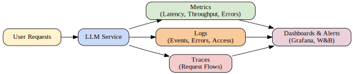

# 🕵️ Monitoring & Reliability

## Overview

Monitoring and reliability are critical pillars for maintaining trustworthy, performant, and robust Large Language Model (LLM) systems in production. As LLMs are increasingly deployed in mission-critical applications, ensuring observability, uptime, and user trust becomes essential. Effective monitoring enables teams to detect anomalies, diagnose issues, and optimize system performance, while reliability strategies ensure continuous service even in the face of failures or unexpected loads.

## Observability

Observability encompasses the practices and tools used to gain insights into the health and behavior of LLM systems. Key components include:

- **Metrics**: Quantitative measurements such as latency, throughput, error rates, GPU utilization, and memory consumption. These are essential for performance tracking and alerting.
- **Logs**: Detailed, time-stamped records of system events, requests, errors, and other runtime information. Logs are invaluable for debugging and post-mortem analysis.
- **Traces**: Distributed traces allow tracking of requests as they traverse through various services, highlighting bottlenecks and failure points.

**Tools:**
- [Prometheus](https://prometheus.io/): Widely used for collecting and querying metrics.
- [Grafana](https://grafana.com/): Visualization and dashboarding for metrics and logs.
- [OpenTelemetry](https://opentelemetry.io/): Standard for collecting telemetry data (metrics, logs, traces) across distributed systems.
- [Weights & Biases (W&B)](https://wandb.ai/site): Popular for experiment tracking and monitoring ML model performance in real time.

## Reliability

Reliability ensures that LLM services remain available and performant, even under stress or failure scenarios. Key strategies include:

- **Fault Tolerance**: Designing systems to gracefully handle component failures without service disruption. For LLMs, this may include retry logic, circuit breakers, and fallback models.
- **Checkpointing**: Regularly saving the state of training or inference processes to allow recovery from interruptions or crashes.
- **Failover & Redundancy**: Deploying redundant instances and automatic failover mechanisms to maintain service continuity in case of node or region failures.
- **Autoscaling**: Dynamically adjusting compute resources based on real-time demand to ensure consistent performance and cost efficiency.

## Monitoring the LLM Lifecycle

LLM systems require monitoring across their entire lifecycle:

- **Pretraining**: Track training progress, resource utilization, loss curves, and checkpoint integrity.
- **Fine-tuning**: Monitor convergence, overfitting, and data quality issues specific to the fine-tuning dataset.
- **Inference Monitoring**: Collect metrics on latency, throughput, model accuracy, and user feedback in production deployments.
- **Drift Detection**: Continuously compare production data distributions and model outputs to training data to detect data or concept drift, triggering retraining or model updates as needed.

## Safety & Compliance

Ensuring safety and compliance is vital, especially for LLMs handling sensitive data or operating in regulated environments:

- **Audit Logging**: Maintain detailed logs of all model interactions, access events, and configuration changes for traceability and compliance audits.
- **Privacy**: Implement privacy-preserving monitoring, such as anonymizing logs and adhering to data retention policies.
- **Security Monitoring**: Detect unauthorized access, model misuse, or data exfiltration attempts through continuous security event monitoring.

## Trade-offs & Best Practices

| Strategy          | Benefit                                | Trade-off / Challenge                |
|-------------------|----------------------------------------|---------------------------------------|
| Metrics           | Fast insights into performance         | May miss detailed context             |
| Logs              | Rich debugging information             | Can become large and costly to store  |
| Traces            | End-to-end visibility of requests      | Overhead in distributed systems       |
| Checkpointing     | Enables recovery after failure         | Adds I/O and storage overhead         |
| Autoscaling       | Matches resources to demand            | Risk of cold starts and scaling lag   |
| Redundancy        | High availability and fault tolerance  | Increases infrastructure costs        |

**Best Practices:**
- Combine metrics, logs, and traces for full observability (the "three pillars").
- Balance checkpoint frequency with storage constraints.
- Test failover scenarios regularly to validate redundancy and recovery.
- Use anomaly detection on metrics to catch subtle issues early.

## 

## Further Reading

- [Observability Best Practices](https://thenewstack.io/observability-best-practices-for-modern-applications/)
- [DeepSpeed Fault Tolerance Documentation](https://www.deepspeed.ai/tutorials/advanced-fault-tolerance/)
- [W&B Monitoring Guides](https://docs.wandb.ai/guides/track)
- [OpenTelemetry Documentation](https://opentelemetry.io/docs/)
