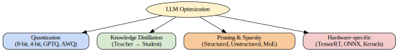

# 🛠 Optimization

## Overview

Optimization is a critical aspect of working with large language models (LLMs). As these models grow in size and complexity, optimizing them becomes essential to improve efficiency, reduce operational costs, and decrease latency during inference. Effective optimization enables deploying LLMs in resource-constrained environments, making them accessible for a wider range of applications and users.

## Quantization

Quantization is a technique that reduces the precision of the numbers used to represent model parameters and activations, thereby reducing memory usage and speeding up computation. Common quantization methods include:

- **8-bit Quantization:** Converts weights and activations from 32-bit floating point to 8-bit integers, providing a good balance between model size reduction and accuracy retention.
- **4-bit Quantization:** Further reduces precision, allowing even smaller model sizes and faster inference, but generally requires more sophisticated techniques to maintain accuracy.
- **GPTQ (Generalized Post-Training Quantization):** A post-training quantization method tailored for transformer models that achieves high accuracy with low-bit quantization.
- **AWQ (Adaptive Weight Quantization):** An advanced quantization approach that adapts quantization parameters to different layers or weights to optimize performance.

## Knowledge Distillation

Knowledge distillation involves training a smaller "student" model to mimic the behavior of a larger "teacher" model. This teacher–student paradigm transfers knowledge from the large model to a compact one, enabling faster inference and lower resource consumption while maintaining competitive performance.

## Pruning & Sparsity

Pruning techniques remove redundant or less important weights from a model to reduce its size and computational requirements. There are two main types:

- **Structured Pruning:** Removes entire neurons, channels, or attention heads, resulting in models that are easier to accelerate on hardware.
- **Unstructured Pruning:** Removes individual weights, leading to sparse models that can be more challenging to optimize but offer fine-grained compression.

Sparsity can also be exploited in architectures like Mixture of Experts (MoE), which activate only a subset of model parameters per input, improving efficiency without sacrificing capacity.

## Hardware-specific Optimizations

Optimizing LLMs for specific hardware platforms can yield significant performance gains. Techniques include:

- Custom GPU kernels designed to accelerate transformer operations.
- Using compilers and runtimes such as **TensorRT** and **ONNX Runtime** to optimize model execution paths.
- Leveraging hardware features like tensor cores and mixed precision arithmetic to maximize throughput.

## Trade-offs

| Aspect      | Size       | Accuracy    | Latency     |
|-------------|------------|-------------|-------------|
| Quantization| ↓          | ↔ / ↓       | ↓           |
| Distillation| ↓          | ↔           | ↓           |
| Pruning     | ↓          | ↔ / ↓       | ↓           |
| Hardware    | ↔          | ↔           | ↓           |

*Note: Arrows indicate relative changes (↓ decrease, ↔ no significant change).*

## Further Reading

- [Post-Training Quantization for Transformers (GPTQ)](https://arxiv.org/abs/2202.10442)
- [Adaptive Weight Quantization (AWQ) Blog](https://example.com/awq-blog)
- [Knowledge Distillation: A Survey](https://arxiv.org/abs/2006.05525)
- [The Lottery Ticket Hypothesis and Pruning](https://arxiv.org/abs/1803.03635)
- [Mixture of Experts for Efficient Models](https://arxiv.org/abs/2101.03961)
