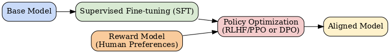

# 🎯 Post-training & Alignment

Post-training is a critical phase in large language model (LLM) development that follows base pretraining. Its primary goals are to adapt a pretrained model to specific tasks, align its behavior with human preferences and values, and improve efficiency and safety for real-world deployment. Post-training transforms a generic language model into an assistant or application-ready system.

This chapter covers the main post-training techniques: Supervised Fine-tuning (SFT), Reinforcement Learning from Human Feedback (RLHF), Direct Preference Optimization (DPO) and variants, as well as evaluation and safety practices.

## Supervised Fine-tuning (SFT)
SFT adapts a pretrained model to follow instructions or perform specific tasks using curated input-output pairs. Human annotators or synthetic generators provide demonstrations (e.g., question–answer pairs, code completions, dialogue turns). The model is trained using standard supervised learning to mimic these responses.

**Key points:**
- SFT is often the first step after pretraining and before preference-based alignment.
- Data quality and diversity are crucial for robust adaptation.
- SFT can be used for both general assistants and domain-specific models.

## Reinforcement Learning from Human Feedback (RLHF)
RLHF further aligns the model’s outputs with human preferences, going beyond imitation. The typical RLHF pipeline involves:

1. **Data Collection:** Gather human preference comparisons between model outputs (e.g., "Which answer is better?").
2. **Reward Model Training:** Train a reward model to predict human preferences from these comparisons.
3. **Policy Optimization:** Use reinforcement learning (commonly Proximal Policy Optimization, PPO) to optimize the main model to maximize the reward model’s score, nudging it toward preferred behaviors.

RLHF helps reduce harmful, unhelpful, or off-topic outputs and encourages helpfulness, honesty, and harmlessness.

## Direct Preference Optimization (DPO) & RLAIF
Direct Preference Optimization (DPO) and related methods (e.g., RLAIF—Reinforcement Learning from AI Feedback) are alternatives to RLHF that directly optimize the model using preference data, often without a separate reward model or explicit RL steps.

- **DPO:** Optimizes the model with a loss that directly incorporates preference pairs, simplifying the pipeline and improving stability.
- **RLAIF:** Uses AI-generated feedback instead of (or in addition to) human feedback, enabling scalable preference collection.

These methods are gaining popularity due to their efficiency and simplicity compared to traditional RLHF.

## Evaluation & Safety
Robust evaluation and safety measures are essential in post-training:

- **Benchmarks:** Use standardized benchmarks (e.g., HELM, TruthfulQA, MT-Bench) to assess helpfulness, honesty, harmlessness, and task performance.
- **Red Teaming:** Actively probe the model for unsafe, biased, or undesirable behaviors using adversarial prompts.
- **Guardrails:** Implement automated filters, moderation, and other controls to prevent harmful outputs.
- **Human Evaluation:** Regularly involve human raters for qualitative assessment, especially for open-ended tasks.

## Further Reading
- [Deep Reinforcement Learning from Human Preferences (Christiano et al., 2017)](https://arxiv.org/abs/1706.03741)
- [OpenAI InstructGPT Blog](https://openai.com/research/instruction-following)
- [Direct Preference Optimization (DPO) Paper](https://arxiv.org/abs/2305.18290)
- [Constitutional AI: Harmlessness from AI Feedback (Anthropic, 2022)](https://www.anthropic.com/constitutional)