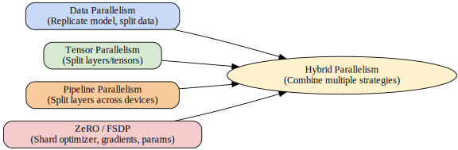

# 🔥 Pre-training

## Overview

Pre-training is the foundational stage in the development of large language models (LLMs) and other modern neural networks. In this phase, a model is exposed to vast amounts of raw data in an unsupervised or self-supervised manner, learning general representations of language, images, or other modalities. The objective is to enable the model to capture broad patterns, knowledge, and structures from the data, which can then be fine-tuned for downstream tasks. Pre-training is critical because it forms the basis for the model's capabilities, transfer learning effectiveness, and overall performance.

Key reasons why pre-training matters:
- **Generalization**: Models learn broad, reusable features.
- **Efficiency**: Reduces the need for massive labeled datasets for every task.
- **Performance**: Pre-trained models often outperform those trained from scratch on specific tasks.
- **Foundation for scaling**: Enables the use of very large models and datasets.

---

## Data Pipeline

The quality and diversity of the data pipeline are crucial to successful pre-training. The main stages include:

- **Collection**: Gathering large-scale datasets from sources such as web crawls (e.g., Common Crawl), books, Wikipedia, code repositories, and more. The scale can range from billions to trillions of tokens.
- **Deduplication**: Removing duplicate or near-duplicate content to prevent overfitting and improve data efficiency. Techniques include hashing, MinHash, and approximate nearest neighbor search.
- **Filtering**: Cleaning data to remove low-quality, toxic, or irrelevant content. Filtering may involve rule-based approaches, classifiers, or heuristics for language, length, or content appropriateness.
- **Multilingual Balance**: Ensuring the dataset represents desired languages and domains. This may require sampling, upsampling, or downsampling to achieve the right balance, especially for multilingual or domain-specific models.

---

## Distributed Training

Due to the scale of modern models and datasets, pre-training almost always requires distributed training across many GPUs or accelerators. Several parallelism strategies are employed:

- **Data Parallelism**: The dataset is split into shards, and each worker processes a different shard with a copy of the model. Gradients are synchronized after each step.
- **Tensor Parallelism**: Model parameters (especially large matrix multiplications) are split across devices, allowing for larger models than fit on a single device.
- **Pipeline Parallelism**: The model is partitioned into sequential stages, each running on different devices. Micro-batches are pipelined through the stages to keep all devices busy.
- **ZeRO/FSDP**: ZeRO (Zero Redundancy Optimizer) and Fully Sharded Data Parallel (FSDP) partition optimizer states, gradients, and parameters across devices, enabling efficient training of very large models with reduced memory overhead.

Pre-training often combines these strategies (hybrid parallelism) to maximize hardware utilization and scalability.

---

## Scaling Laws

Scaling laws describe how model performance improves as the number of parameters, dataset size, and compute budget increase. Key findings include:

- **Kaplan et al. (2020)**: Demonstrated that loss scales predictably with model, data, and compute; larger models and datasets generally yield better performance if trained with sufficient compute.
- **Chinchilla (Hoffmann et al., 2022)**: Showed that many previous models were undertrained relative to their size. For a fixed compute budget, there is an optimal trade-off between model size and dataset size—training smaller models on more data can be more efficient.
- **Compute-optimal training**: Modern pre-training is often planned to be compute-optimal, balancing model size and number of training tokens to achieve the best performance for a given compute budget.

---

## Infrastructure

Pre-training at scale requires specialized infrastructure:

- **GPU Clusters**: Large numbers of high-memory GPUs (e.g., NVIDIA A100, H100) interconnected via high-bandwidth networks (InfiniBand, NVLink).
- **TPUs and Other Accelerators**: Google TPUs and custom accelerators (e.g., AWS Trainium, Graphcore IPUs) are also used for large-scale pre-training.
- **Networking**: Fast, low-latency interconnects are essential for efficient distributed training. Topologies like fat-tree, dragonfly, and direct GPU-to-GPU links are common.
- **Storage**: High-throughput storage systems are needed to feed massive datasets to the cluster without bottlenecks.
- **Orchestration**: Cluster management tools (Slurm, Kubernetes, Ray) and distributed training frameworks (DeepSpeed, Megatron-LM, Fairscale) manage resource allocation and job scheduling.

---

## Diagram

---

## Further Reading

- [Kaplan et al., "Scaling Laws for Neural Language Models" (2020)](https://arxiv.org/abs/2001.08361)
- [Hoffmann et al., "Training Compute-Optimal Large Language Models" (Chinchilla, 2022)](https://arxiv.org/abs/2203.15556)
- [OpenAI GPT-3 Paper](https://arxiv.org/abs/2005.14165)
- [DeepSpeed: System Optimizations for Training Large-Scale Deep Learning Models](https://www.microsoft.com/en-us/research/blog/deepspeed-extreme-scale-model-training-for-everyone/)
- [Megatron-LM: Training Multi-Billion Parameter Language Models Using Model Parallelism](https://arxiv.org/abs/1909.08053)
- [EleutherAI Blog: The Pile — An 800GB Dataset of Diverse Text for Language Modeling](https://pile.eleuther.ai/)